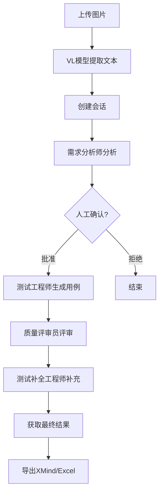

# AI需求分析系统 - 图片上传与VL模型API文档

## 系统概述

本系统支持上传图片格式的需求文档，使用Vision-Language（VL）模型进行文本识别，然后通过多智能体协作进行需求分析和测试用例生成。

## 环境要求

### 必需的环境变量
```bash
QWEN_API_KEY=sk-xxxxx          # 通用API密钥
QWEN_BASE_URL=https://...      # API基础URL
VL_ENABLED=true                # 启用VL功能
VL_MODEL=qwen-vl-plus         # VL模型选择
```

### Docker部署
```bash
docker compose up -d
```

服务默认运行在 **8020** 端口

## API接口文档

### 1. 健康检查

**接口**: `GET /healthz`

**描述**: 检查服务是否正常运行

**示例**:
```bash
curl http://localhost:8020/healthz
```

**响应**:
```json
{
    "status": "ok"
}
```

---

### 2. 文档上传

**接口**: `POST /api/uploads`

**描述**: 上传需求文档（支持图片、PDF、Word、文本文件）

**请求**:
- Content-Type: `multipart/form-data`
- Body: 文件字段名为 `file`

**示例**:
```bash
curl -X POST http://localhost:8020/api/uploads \
  -F "file=@requirements.png"
```

**响应**:
```json
{
    "document": {
        "id": "7bc6fb69-f419-4061-95b2-3b4f7aec3fcd",
        "original_name": "requirements.png",
        "storage_path": "/app/storage/uploads/addc33...",
        "checksum": "addc33898e373c2246d35c087db99f9d960ecf12...",
        "size": 147415,
        "status": "uploaded",
        "expires_at": "2025-10-23T06:45:07.126430",
        "created_at": "2025-10-20T06:45:07.126883",
        "updated_at": "2025-10-20T06:45:07.126885"
    },
    "is_duplicate": false
}
```

**状态码**:
- 200: 上传成功
- 413: 文件过大（默认限制10MB）
- 500: 服务器错误

---

### 3. 图片快速分析（新增）

**接口**: `POST /api/images/analyze`

**描述**: 快速分析图片中的需求文本，无需创建完整会话

**请求**:
- Content-Type: `multipart/form-data`
- Body: 文件字段名为 `file`
- 支持格式: PNG, JPG, JPEG, BMP

**示例**:
```bash
curl -X POST http://localhost:8020/api/images/analyze \
  -F "file=@requirements.png"
```

**响应**:
```json
{
    "success": true,
    "message": "Successfully extracted requirements from image",
    "extracted_text": "### 1. 业务场景\n图片中的内容描述了...",
    "text_length": 1887,
    "model_used": "qwen-vl-plus",
    "filename": "requirements.png"
}
```

**特性**:
- 使用VL模型提取图片文本
- 支持缓存（7天有效期）
- 结构化的需求文本输出

**状态码**:
- 200: 分析成功
- 400: 不支持的图片格式
- 413: 文件过大
- 503: VL模型不可用
- 500: 分析失败

---

### 4. 创建分析会话

**接口**: `POST /api/sessions`

**描述**: 创建需求分析会话，启动多智能体工作流

**请求**:
```json
{
    "document_ids": ["document-uuid"],
    "config": {
        "enable_review": true,
        "model": "qwen-plus"
    },
    "created_by": "user_name"
}
```

**示例**:
```bash
curl -X POST http://localhost:8020/api/sessions \
  -H "Content-Type: application/json" \
  -d '{
    "document_ids": ["7bc6fb69-f419-4061-95b2-3b4f7aec3fcd"],
    "config": {
      "enable_review": true,
      "model": "qwen-plus"
    },
    "created_by": "test_user"
  }'
```

**响应**:
```json
{
    "session_id": "586974d0-995d-43ce-9e07-2c5ffd1ec2be",
    "status": "created",
    "expires_at": "2025-10-23T09:50:08.277353"
}
```

---

### 5. 查询会话状态

**接口**: `GET /api/sessions/{session_id}`

**描述**: 获取会话详细信息和进度

**示例**:
```bash
curl http://localhost:8020/api/sessions/586974d0-995d-43ce-9e07-2c5ffd1ec2be
```

**响应**:
```json
{
    "id": "586974d0-995d-43ce-9e07-2c5ffd1ec2be",
    "status": "processing",
    "current_stage": "requirement_analysis",
    "progress": 0.3,
    "created_at": "2025-10-20T09:50:08.282617",
    "expires_at": "2025-10-23T09:50:08.277353",
    "config": {
        "enable_review": true,
        "model": "qwen-plus"
    },
    "documents": [
        {
            "id": "7bc6fb69-f419-4061-95b2-3b4f7aec3fcd",
            "original_name": "requirements.png",
            "size": 147415,
            "status": "uploaded"
        }
    ]
}
```

**会话状态**:
- `created`: 已创建
- `processing`: 处理中
- `awaiting_confirmation`: 等待人工确认
- `completed`: 已完成
- `failed`: 失败

**处理阶段**:
- `requirement_analysis`: 需求分析（需求分析师）
- `test_generation`: 测试用例生成（测试工程师）
- `review`: 质量评审（质量评审员）
- `test_completion`: 测试用例补全（测试补全工程师）

---

### 6. 人工确认

**接口**: `POST /api/sessions/{session_id}/confirm`

**描述**: 确认继续或拒绝当前阶段的结果

**请求**:
```json
{
    "stage": "requirement_analysis",
    "decision": "approve",
    "comment": "看起来不错，继续"
}
```

**decision选项**:
- `approve`: 批准继续
- `reject`: 拒绝（终止流程）
- `retry`: 重试当前阶段

---

### 7. 获取分析结果

**接口**: `GET /api/sessions/{session_id}/results`

**描述**: 获取最终的分析结果和测试用例

**示例**:
```bash
curl http://localhost:8020/api/sessions/586974d0-995d-43ce-9e07-2c5ffd1ec2be/results
```

**响应**:
```json
{
    "analysis": {
        "modules": ["登录模块", "设备管理", "系统设置"],
        "scenarios": ["设备登录", "参数配置", "固件升级"],
        "business_rules": ["IP默认192.168.1.21", "支持Chrome浏览器"],
        "risks": ["不支持在线降级", "需要返厂处理"]
    },
    "test_cases": {
        "test_cases": [
            {
                "id": "TC001",
                "title": "验证设备登录功能",
                "preconditions": "设备已启动，网络连接正常",
                "steps": [
                    "打开Chrome浏览器",
                    "输入设备IP地址192.168.1.21",
                    "输入用户名和密码",
                    "点击登录"
                ],
                "expected_result": "成功登录到设备管理界面",
                "priority": "高",
                "type": "功能测试"
            }
        ],
        "total_count": 25,
        "by_priority": {
            "高": 10,
            "中": 10,
            "低": 5
        }
    },
    "statistics": {
        "total_cases": 25,
        "coverage_rate": "85%",
        "missing_areas": ["性能测试", "安全测试"]
    },
    "version": 1
}
```

---

### 8. 导出结果

#### 导出为XMind思维导图

**接口**: `POST /api/sessions/{session_id}/export/xmind`

**描述**: 将分析结果导出为XMind文件

#### 导出为Excel表格

**接口**: `POST /api/sessions/{session_id}/export/excel`

**描述**: 将测试用例导出为Excel文件

---

### 9. WebSocket实时通知

**接口**: `ws://localhost:8020/ws/{session_id}`

**描述**: 订阅会话的实时进度通知

**消息格式**:
```json
{
    "type": "agent_message",
    "sender": "需求分析师",
    "stage": "requirement_analysis",
    "content": "正在分析需求文档...",
    "progress": 0.3,
    "needs_confirmation": false,
    "timestamp": 1729415448.123
}
```

---

## 工作流程

### 完整的端到端流程



### 图片处理流程

1. **图片上传**: 用户上传PNG/JPG/JPEG/BMP格式图片
2. **VL模型识别**: 使用qwen-vl-plus模型提取文本
3. **缓存检查**: 基于SHA256哈希检查缓存
4. **文本提取**: 结构化提取需求信息
5. **智能体分析**: 多智能体协作处理

---

## 使用示例

### 快速测试图片识别

```bash
# 1. 上传并快速分析图片
curl -X POST http://localhost:8020/api/images/analyze \
  -F "file=@requirements.png" \
  | python -m json.tool
```

### 完整的需求分析流程

```bash
# 1. 上传文档
RESPONSE=$(curl -s -X POST http://localhost:8020/api/uploads \
  -F "file=@requirements.png")
DOC_ID=$(echo $RESPONSE | python -c "import sys, json; print(json.load(sys.stdin)['document']['id'])")

# 2. 创建会话
SESSION_RESPONSE=$(curl -s -X POST http://localhost:8020/api/sessions \
  -H "Content-Type: application/json" \
  -d "{
    \"document_ids\": [\"$DOC_ID\"],
    \"config\": {
      \"enable_review\": true
    }
  }")
SESSION_ID=$(echo $SESSION_RESPONSE | python -c "import sys, json; print(json.load(sys.stdin)['session_id'])")

# 3. 监控进度
while true; do
  STATUS=$(curl -s http://localhost:8020/api/sessions/$SESSION_ID | \
    python -c "import sys, json; d=json.load(sys.stdin); print(d['status'])")

  if [ "$STATUS" = "completed" ]; then
    break
  elif [ "$STATUS" = "awaiting_confirmation" ]; then
    # 自动确认
    curl -X POST http://localhost:8020/api/sessions/$SESSION_ID/confirm \
      -H "Content-Type: application/json" \
      -d '{"stage": "requirement_analysis", "decision": "approve"}'
  fi

  sleep 5
done

# 4. 获取结果
curl http://localhost:8020/api/sessions/$SESSION_ID/results | python -m json.tool
```

---

## 性能优化

### VL模型缓存

- **缓存键**: `vl_extract:{model}:{image_hash}`
- **过期时间**: 7天
- **存储**: Redis
- **优势**: 相同图片二次处理速度提升10倍以上

### 错误处理

- **重试机制**: 3次重试，指数退避
- **降级方案**: VL失败可降级到OCR（预留接口）
- **超时控制**: 单次API调用120秒超时

---

## 注意事项

1. **文件大小限制**: 默认10MB，可通过MAX_FILE_SIZE环境变量调整
2. **支持的图片格式**: PNG, JPG, JPEG, BMP
3. **API密钥**: 必须配置QWEN_API_KEY才能使用VL功能
4. **并发限制**: 建议同时处理的会话不超过10个
5. **缓存清理**: Redis缓存自动过期，无需手动维护

---

## 错误码说明

| 状态码 | 说明 | 处理建议 |
|--------|------|----------|
| 200 | 成功 | - |
| 400 | 请求参数错误 | 检查请求格式和参数 |
| 404 | 资源不存在 | 检查ID是否正确 |
| 413 | 文件过大 | 减小文件大小或调整限制 |
| 500 | 服务器内部错误 | 查看服务器日志 |
| 503 | 服务不可用 | 检查VL模型配置和API密钥 |

---

## 部署建议

### 生产环境配置

```yaml
# docker-compose.yml
services:
  backend:
    environment:
      - QWEN_API_KEY=${QWEN_API_KEY}
      - VL_ENABLED=true
      - VL_MODEL=qwen-vl-plus
      - DATABASE_URL=postgresql://...
      - REDIS_URL=redis://redis:6379/0
      - MAX_FILE_SIZE=20971520  # 20MB
    volumes:
      - ./storage:/app/storage
    deploy:
      resources:
        limits:
          memory: 2G
        reservations:
          memory: 1G
```

### 监控指标

- 会话成功率
- VL模型调用次数
- 缓存命中率
- 平均处理时间
- 错误率统计

---

## 更新日志

### v1.0.0 (2025-10-20)
- ✅ 实现图片上传功能
- ✅ 集成VL模型（qwen-vl-plus）
- ✅ 添加专用图片分析API
- ✅ 实现Redis缓存机制
- ✅ 增强错误处理和重试逻辑
- ✅ 完成端到端测试验证

---

## 联系支持

如遇到问题，请检查：
1. Docker容器日志: `docker logs ai_requirement_backend`
2. API密钥配置: 确保QWEN_API_KEY正确设置
3. 网络连接: 确保能访问DashScope API服务